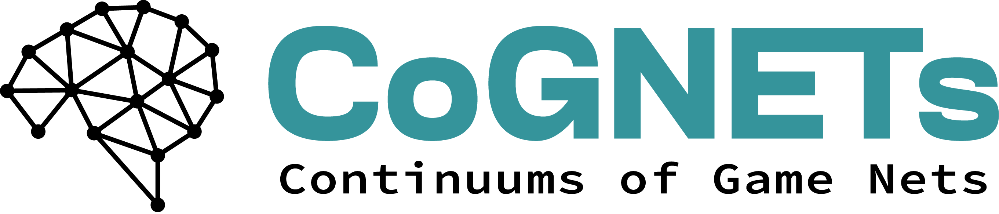

<div align="center" style="display: flex; justify-content: center; align-items: center; gap: 20px;">
    
    
</div>

# CoGNETs Game Catalogue – Kelly Mechanism Simulations

Welcome to the repository for **Kelly Mechanism Simulations** developed within the **CoGNETs Project (Continuums of Game NETs)**.  
This repository provides simulation scripts and learning algorithms for resource allocation games, as detailed in the **CoGNETs Game Catalogue (Section 5.1: Kelly Mechanism)**.

---

## 📚 Reference: CoGNETs Game Catalogue

This repository implements algorithms described in the CoGNETs Game Catalogue:

- **5.1.3 Learning via Dual Averaging**
- **5.1.4 Learning via Best Response Dynamics**

**Features:**
- Complete **problem formulation** for proportional resource allocation games
- Algorithms for **computing Nash equilibria**
- Distributed learning algorithms:
  - **Dual Averaging (DAQ and DAH)**
  - **Best Response Dynamics (SBRD)**
  - **Exponential Learning (XL)**

---

📄 **Related Publication:**  
_"Learning to Bid in Proportional Allocation Auctions with Budget Constraints."_

👉 [Access the report on HAL](https://hal.archives-ouvertes.fr/hal-XXXXXXX) <br>

---

## 🔍 Problem Scope

The **Kelly Mechanism** addresses resource allocation in settings such as edge networks, where multiple agents (players) compete for a shared resource by bidding.
Each agent seeks to maximize a utility function under budget and resource constraints.

This project focuses on the study and simulation of **distributed learning dynamics** in such strategic, multi-agent environments.

---

## ⚙️ Algorithms Implemented

- **Synchronous Best Response Dynamics (SBRD):**  
  Iterative computation of each player's best response.  
  _Focus:_ Equilibrium search, convergence/divergence analysis

- **Dual Averaging, with Quadratic regulizer (DAQ) and Hentropic regulizer (DAH):**  
  No-regret, gradient-based learning.  
  _Focus:_ Robustness and stability under noisy feedback

- **Exponential Learning (XL):**  
  Acceleration of Dual Averaging dynamics for improved convergence speed

---

## 🗂️ Project Structure

```
├── config.py            # Defines simulation parameters for running various algorithms and comparing their convergence speeds (results summarized in tables)
├── main.py              # Main script: orchestrates experiments and generates performance results
├── main_table.py        # Runs experiments for varying game sizes and player heterogeneity, generating tables comparing algorithm convergence speeds (steps to converge)
├── utils.py             # Core module:
│                         ├── Implements the Kelly game and α-fair utility functions
│                         ├── Includes learning algorithms: Dual Averaging (DA), Synchronous Best Response Dynamics (SBRD), and Exponential Learning (XL)
│                         └── Helper functions (plotting, etc.)
└── README.md            # Project documentation (this file)
```

---

## 🚀 Getting Started

 **Run experiments:**  
   Edit `config_data.py` to set up your scenario, then execute:
    ```bash
    python main.py
    ```
    Or:
       ```bash
    python main_table.py
    ```

---

## 🤝 Acknowledgements

This research was conducted as part of the CoGNETs project (WP3 2024–2025), with the support of Avignon University.

---
